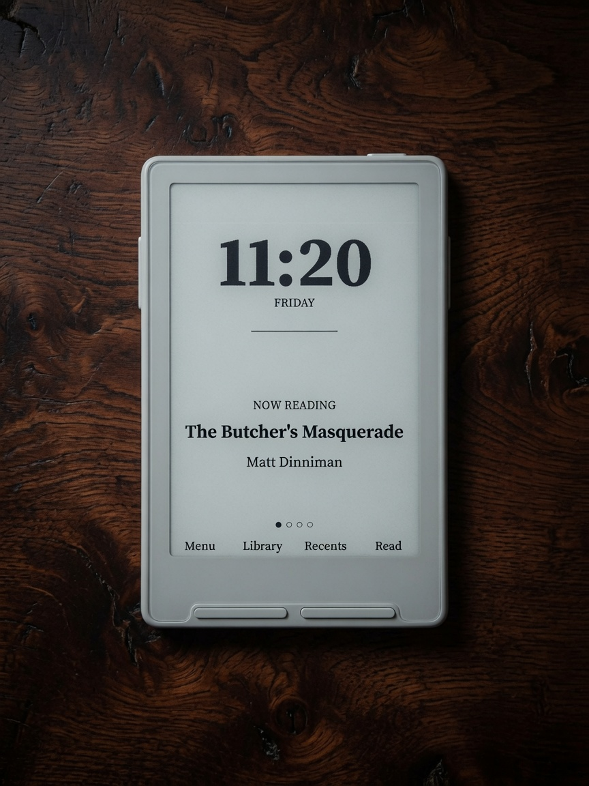
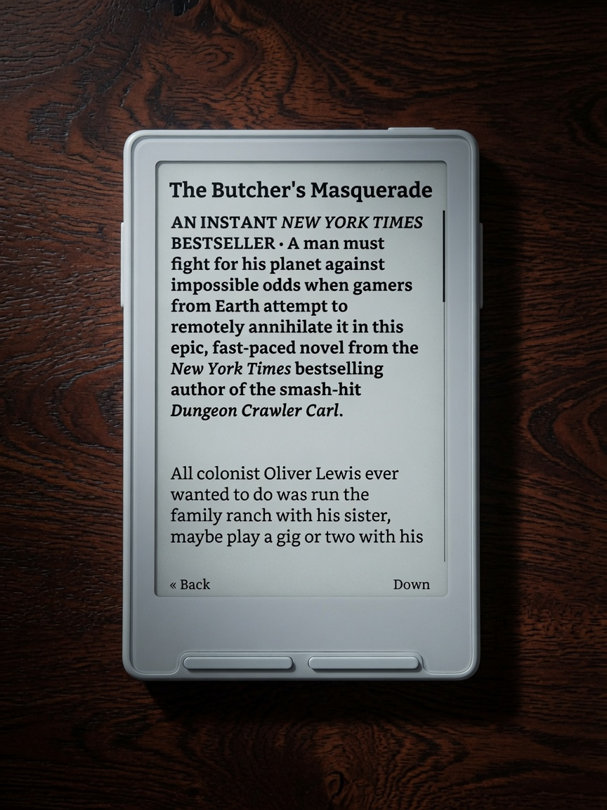
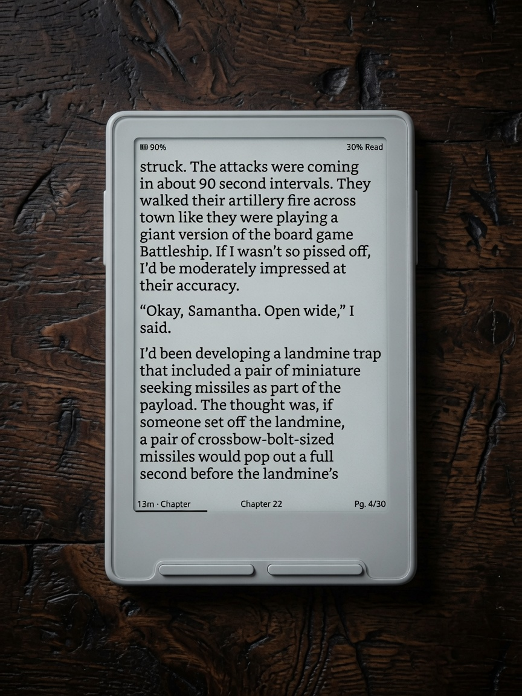
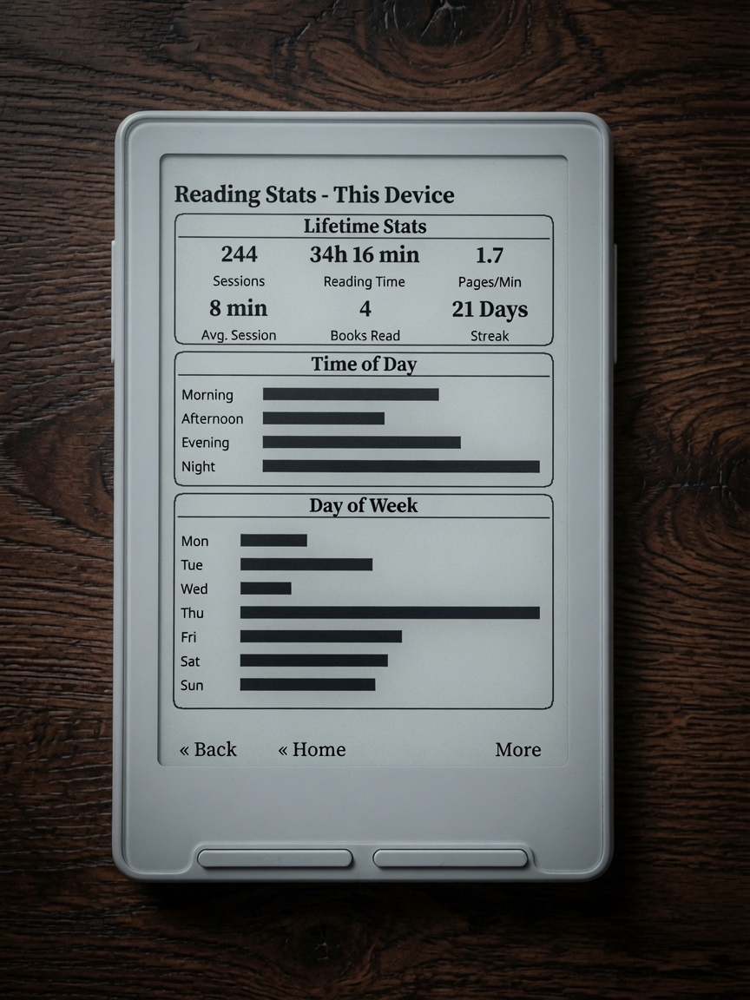
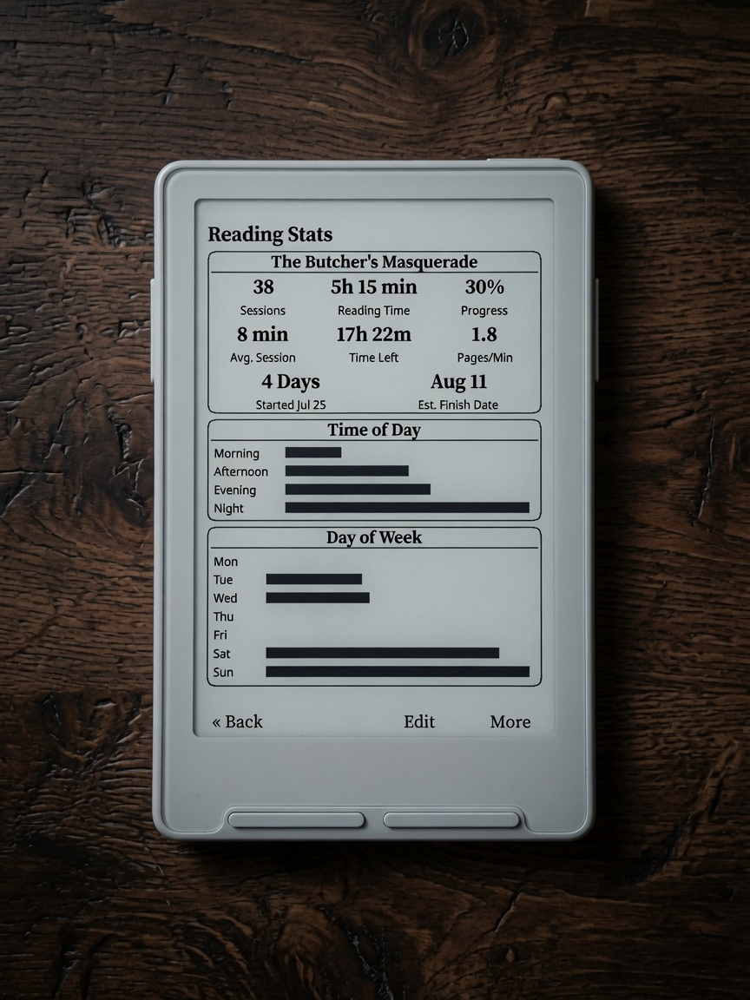
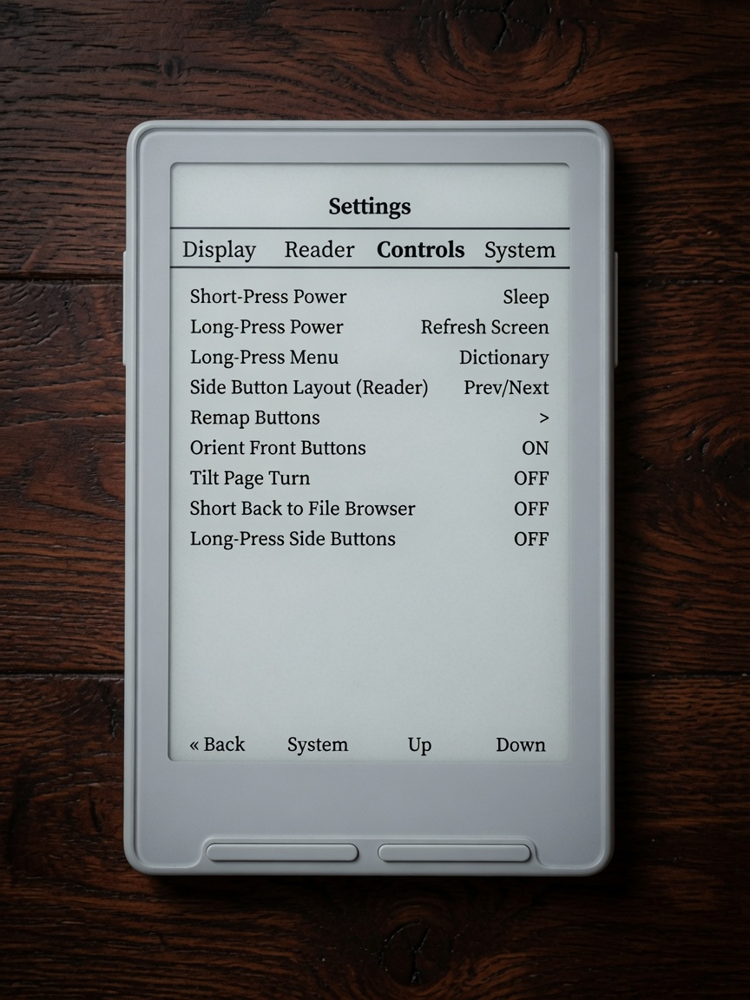
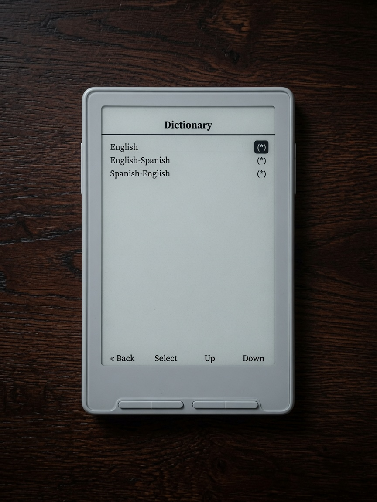
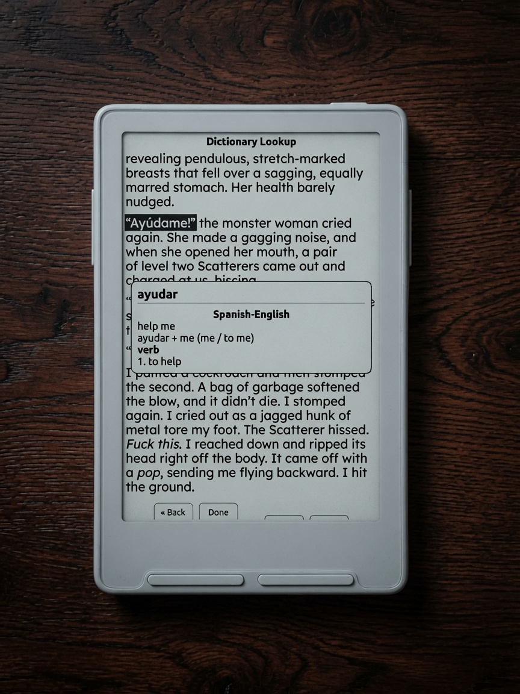
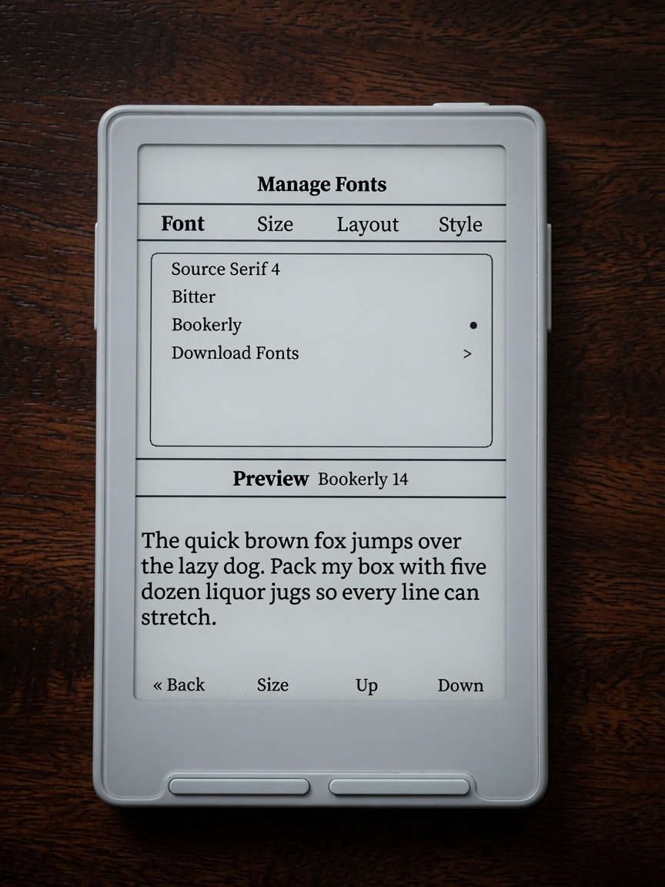
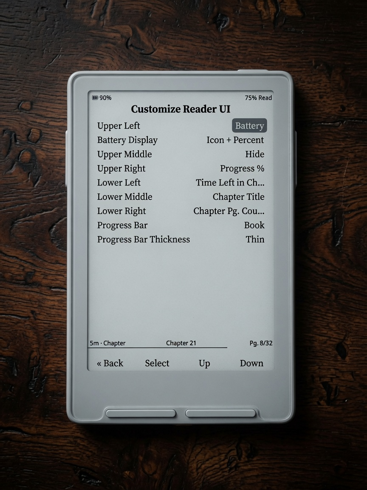

# Casper

Personal firmware for **Xteink X3/X4**, based on
**[CrossPoint Reader 1.5.0](https://github.com/crosspoint-reader/crosspoint-reader/tree/release/1.5.0)** & **[CrossInk](https://github.com/uxjulia/CrossInk)**. Huge thanks to everyone for all their hard work!

Casper keeps CrossPoint's stable reader core, and CrossInk's AMAZING Stat Tracking, and adds a redesign to the UI — thoughtful long-press menus, fully customizable **Reader UI**, **Synopsis Viewer**, and **StarDict Dictionary** with multi-word selection and bilingual packs. Home themes: **Penumbra** (X3 clock / X4 title) and **Bare**.

<h2 align="center">Themes</h2>

<p align="center">
  Home skins for different reading styles. Pick one under <strong>Settings → Display → Theme</strong>.
</p>

| Penumbra (X3) | Penumbra (X4) | Bare |
|:-------------:|:-------------:|:----:|
|  |  |  |

> **Note:** Clock, weekday, and certain date/time features on Penumbra need the **X3** RTC (the X4 has no real-time clock). Bare looks the same on both devices.

<p align="center">
  <strong>Penumbra Demo</strong><br />
  
</p>

<h2 align="center">Gallery</h2>

| Penumbra Recents | Penumbra Book Stats | Penumbra Lifetime | Synopsis |
|:----------------:|:-------------------:|:-----------------:|:--------:|
|  |  |  |  |

| Reading UI | Multi-Word Lookup | Dictionary Lookup | Reading Stats |
|:----------:|:-----------------:|:-----------------:|:-------------:|
|  |  |  |  |

| Lifetime Stats | Controls | Dictionary Settings | Spanish Translation |
|:--------------:|:--------:|:-------------------:|:-------------------:|
|  |  |  |  |

| Manage Fonts | Customize Reader UI | Settings |
|:------------:|:-------------------:|:--------:|
|  |  |  |

**Full photo tour:** **[docs/casper.md](./docs/casper.md)**

---

## Features

Feature overview from **[Casper v0.1.4](https://github.com/tweakerinc/casper/releases/tag/v0.1.4)** (themes, status bars, snappier home, and UI polish). Full release notes and firmware assets are on the [Releases](https://github.com/tweakerinc/casper/releases) page.

### Themes

#### Penumbra

Text-first home with under-panels on the side buttons.

| | |
|---|---|
| **X3** | Large clock + weekday, then cycle **Title · Recents · Book Stats · Lifetime** (side Left / Right). |
| **X4** | Last-read title/author on top, **Recents** list below (side Up / Down scrolls the list). |

`Menu` · `Library` · `Recents` · `Read`

- Long-press **Menu** → Settings  
- Long-press **Read** → book quick menu (mark finished, remove from recents, clear cache, synopsis, etc.)

#### Bare

Designed for readers who simply want to feel as if it is them and their book — a minimal cover theme, same layout on X3 and X4.

`Menu` · `Library` · `Recents` · `Read`

- Long-press **Menu** → Settings  
- Long-press **Read** → book quick menu  

> **Note:** Clock, weekday, and other date/time home features need the **X3** RTC. The X4 has no real-time clock. Bare looks the same on both devices.

### System + Reader Status Bars

Fully customizable status bars with slot-based placement and live previews.  
Choose exactly what appears in the top status bar and position items in any of the **6 available slots** (Top/Bottom × Left/Middle/Right) independently for the **system UI** and the **reader**.

### Battery Display Options

Independent control for system and reader:

- Hidden  
- Icon only  
- Percent only  
- Icon + Percent  

### Manage Fonts

Completely redesigned with tabs, 50/50 live preview, a Download Fonts row, and improved organization.  
Default fonts are now **Source Serif 4** and **Bitter**.  
This is where you set font, size, layout, and style for how books are displayed, with a clean preview of every change.

### Tabbed Navigation + Button Remapping

Fully customizable button remapping.  
Front buttons act as a list; side buttons can be set as tabs (or whatever you prefer).  
A popular setup is using the side buttons as left/right controls to scroll through horizontal tabs.

Keyboard / Wi‑Fi password footer labels follow your remap (Left stays Left, Up stays Up).

### System → Stats Folder

New options under **Settings → System → Stats**:

- Enable / Disable Stat Tracking  
- Auto Backup  
- Backup Now  

You can turn stats off completely if you prefer a distraction-free reading experience. When tracking is on, Penumbra’s Book Stats and Lifetime panels use that data.

### Cover Thumbnail Pipeline

Improved cover generation for clearer, higher-quality thumbnails (home multipass greys on Bare).

### UI Polish

Unified design language across the interface:

- Black chips instead of grey highlights  
- Better title centering  
- Cleaner version string  
- Fixed long-press behavior in the Library  
- Sleep screen options: **Casper Dark** / **Casper Light** (alphabetized)  
- After flash / cold boot lands on **Home** (not auto-open last book)

### Book Synopsis

Open a short description of the current book from the **book quick menu** (long-press **Read** on home, or long-press a book in the library). Requires synopsis metadata — easy to add with Calibre.

Useful for refreshing your memory or choosing your next book without leaving the device.

### Reader Shortcuts

- Long-press **Select** → Dictionary  
- Long-press **Select** again while in dictionary → Multi-word select mode  
- **Menu** button → Reader options menu  

### Dictionary

Offline StarDict packs on the SD card, with multi-pack cascade and multi-word selection.

To install dictionaries, extract the `.dictionaries` folder to the **root of your SD card**.

### Snappier Home Screen

Returning to the home cover after reading should feel faster and less “busy.”

#### Faster return from reading

- When you open a book from Home, Home stays in the background instead of being torn down and rebuilt.
- Pressing **Back** restores that Home instance: progress/stats refresh and the cover greys redraw once, without redoing the full home setup path.
- If cover thumbnails are already on disk (the usual case after you’ve opened a book before), Home skips the intermediate black-and-white shell refresh and goes straight to the grayscale cover pass.

#### Fewer wasted full redraws

- Cancelling the book action menu (long-press Read → Back/cancel) repaints Home once and no longer forces a full cover re-scan/generation.
- Once the home cover greys have settled, stray repaint requests no longer re-flash the full multipass (Bare, Penumbra, and classic list themes).
- **Back** from the in-home Menu returns to the cover (no longer stuck until Settings).

#### Faster cover multipass (panel-aware)

- On X4 and similar panels, the grayscale base step uses a faster refresh mode where appropriate.
- X3 still uses the cleaner half refresh so the previous reader page is less likely to ghost through the cover.

### Also in v0.1.4

| Area | Change |
|------|--------|
| Power button | Long-press **Force Refresh** no longer also sleeps on release (short = Sleep, long = Refresh). |
| Boot | After flash / cold boot → **Home**, not last book. Quick Resume still works on sleep wake (including X4 on battery). |
| Bare menu | **Back** closes the menu and restores the cover. |
| Wi‑Fi keyboard | Footer labels match button remapping (front + side). |
| Penumbra | Weekday more reliable after clock sync. |
| Notes | One bin for X3 and X4. Wi‑Fi passwords live on SD (`/.crosspoint/wifi.json`, device-tied). Sync clock on X3 if weekday/time look wrong after install. |

---

## Docs

| Doc | Contents |
|-----|----------|
| [docs/casper.md](./docs/casper.md) | Visual showcase of Casper changes (photos) |
| [CASPER.md](./CASPER.md) | Scope, APIs, defaults, implementation notes |
| [docs/dictionary.md](./docs/dictionary.md) | StarDict install and lookup behavior |
| [dist/dictionaries/README.txt](./dist/dictionaries/README.txt) | Shipping dictionary packs |

## Build

```bat
pio run -e default
```

Flash with the CrossPoint web installer (**Custom .bin**) or `esptool` (app at
`0x10000`). Version label: **v0.1.4**.

## Credits

- [CrossPoint Reader](https://github.com/crosspoint-reader/crosspoint-reader) — firmware base  
- Casper branding / UI overlay — this project  

## License

See [LICENSE](./LICENSE) (upstream MIT / project terms).
