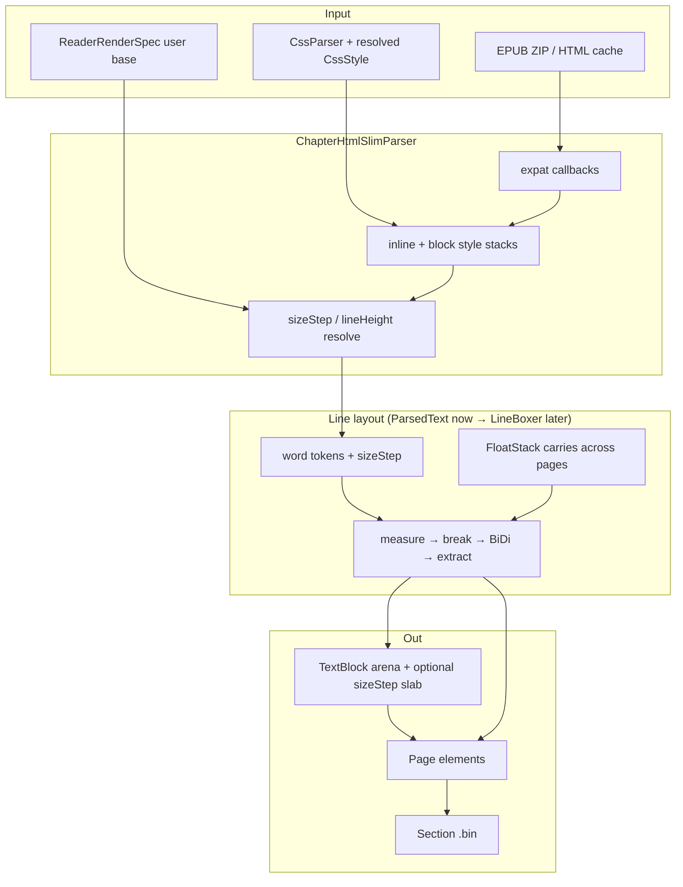
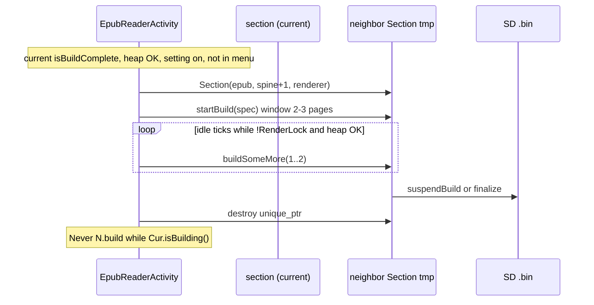
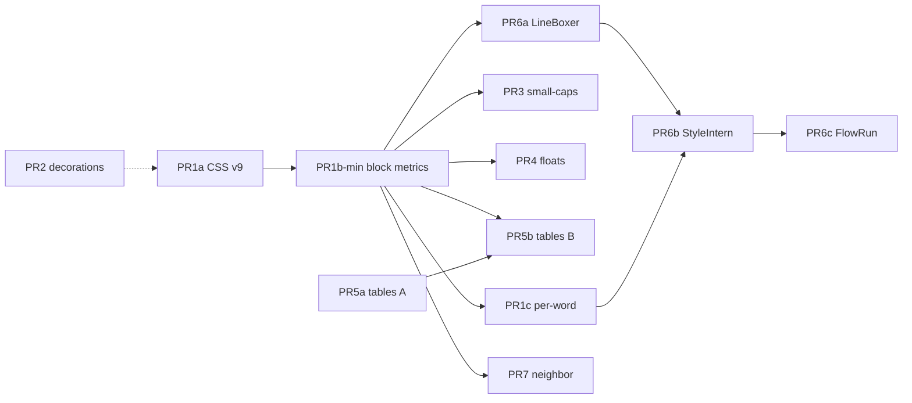

# Rivulet Layout Core (RLC): Casper Robust Original EPUB Rendering Engine

| Field | Value |
|-------|--------|
| **Document** | Rivulet Layout Core design |
| **Author** | TBD (Casper / CrossPoint contributor) |
| **Date** | 2026-08-08 |
| **Status** | Draft (rev 4 — quality pass: SD ladder, paint parity, small-caps, half-leading) |
| **Scope** | `lib/Epub/` render path only — no new top-level activities |
| **Hardware target** | ESP32-C3 ~320–380 KB usable RAM, no PSRAM, SD page cache |

---

## Overview

Casper already ships a capable stream-oriented EPUB pipeline (SAX HTML → CSS cascade → `ParsedText` → page lines → SD section `.bin` cache) with strengths Witchhunt Reader explicitly lacks: full BiDi/RTL, FreeInk/Casper UI discipline, hyphenation, focus/guide reading, and incremental section build with partial resume. A Calibre library probe (`scripts/_probe_calibre_epubs.py` over `e:\Calibre eBooks`, 141 EPUBs, 21 sampled) shows nearly every modern book depends on **CSS font-size** and **line-height**, with frequent small-caps, float figures, and occasional drop caps / tables that currently degrade reading quality.

**Rivulet Layout Core (RLC)** is an original architecture for Casper: a **stream-first, style-interned, float-aware line boxer** that never builds a full-chapter DOM, replaces multi-vector `ParsedText` pressure over time with compact **flow runs**, and applies a measured CSS subset chosen by corpus frequency and RAM cost. Competitive bar is Witchhunt’s *public* feature list only — **no Witchhunt source is copied**; Casper invents cleaner, more measurable structures that fit ESP32-C3 budgets and retain BiDi, SD caching, and progressive indexing.

**Rev 2** hardens the implementation contract: end-to-end multi-font measure/paint/serialize, SD font ladders, mixed-size line boxes, float page-carry and paint order, table Tier B vs SAX resume, honest RAM peaks, cache version matrix, and a split PR plan. **Rev 3** fixes paint fallback to always use `BlockStyle.sizeStep` when the per-word slab is absent, and resolves `line-height` percent against font metrics (not viewport).

---

## Background & Motivation

### Current pipeline (verified)

```
container.xml → OPF → spine[i]
       ↓
ChapterHtmlSlimParser (expat SAX, resumable begin/step/finish)
       ↓  CssParser::resolveStyle + inline style
ParsedText (words / styles / continues / noSpace / focusSuffix vectors)
       ↓  layoutAndExtractLines → TextBlock arena
Page { PageLine | PageImage | PageHorizontalRule } → Section .bin (v69)
```

| Component | Path | Role today |
|-----------|------|------------|
| Slim parser | `lib/Epub/Epub/parsers/ChapterHtmlSlimParser.cpp` | SAX, style stack, tables, images, incremental parse; Rivulet sizeStep + floats + drop-cap |
| CSS model | `lib/Epub/Epub/css/CssStyle.h`, `CssParser.cpp` | Margins, align, bold/italic, decoration, direction, super/sub, image size, **font-size / line-height / float / font-variant** |
| Style resolve | `lib/Epub/Epub/css/StyleResolve.*` | sizeStep 0..4 ladder (builtin + SD hook), line-height px, small-caps, synthetic DROP_CAP |
| Word stream | `lib/Epub/Epub/ParsedText.h/.cpp` | Multi-`std::vector` + BiDi scratch; OOM-gated reserve (`kHeapFloor` 12 KB); synthetic-scale measure |
| Painted line | `lib/Epub/Epub/blocks/TextBlock.*` | Single arena; sizeStep/lineHeightPx/smallCaps/syntheticScale; half-leading paint |
| Image | `lib/Epub/Epub/blocks/ImageBlock.*` | JPEG/PNG, lazy extract, PXC session cache |
| Section cache | `lib/Epub/Epub/Section.*` | `SECTION_FILE_VERSION = 69`, partial `0xFE-(v-28)`, incremental `startBuild` / `buildSomeMore` / `suspendBuild` |
| Render key | `lib/Epub/Epub/ReaderRenderSpec.h` | fontId, lineCompression, viewport, hyphen, embeddedStyle, focus/guide |
| Page paint | `Page.cpp` + `setPaintStyleResolveParams` | Reader base `fontId`; TextBlock re-resolves sizeStep with measure-matched paint params |

### Pain points (corpus-backed)

| Gap | Evidence | Reading impact |
|-----|----------|----------------|
| CSS `font-size` ignored | `CssStyle` has no field; layout uses single `fontId` from settings | **21/21** samples |
| CSS `line-height` ignored | `addLineToPage` always uses `getLineHeight(fontId, lineCompression)` | **18/21** |
| Small-caps missing | No `font-variant` | **9/21** |
| Float / wrap missing | Images centered block (`xPos = (viewportWidth - displayWidth) / 2`) | **8/21** |
| Tables linearised | `"Tab Row N, Cell M:"` (~L510–511) | **3/21** but Silmarillion matters |
| Drop caps missing | No first-letter path | **4/21** |
| Multi-spine stress | Omnibus 250–508 HTML files | Indexing UX |
| Build-time heap | Parallel vectors in `ParsedText` | Soft-fail / abort risk |

### What Casper already does well (retain)

- **Strikethrough paint path is present** — `TextBlock::render` `DecorationLineTracker` for `UNDERLINE` and `STRIKETHROUGH` (`TextBlock.cpp` L155–162); section v28+ serializes decoration bits. PR2 is audit/fixtures, not greenfield.
- BiDi/RTL, multi-language hyphenation, focus + guide dots, incremental section build + partial suspend, image dims probe + lazy extract, TextBlock **arena** anti-fragmentation pattern.

### Competitive bar (Witchhunt public README only)

| Capability | Witchhunt (public) | Casper target via Rivulet |
|------------|--------------------|---------------------------|
| Float L/R wrap | Yes | Yes (cap-2 exclusion zones + page-carry) |
| Real tables | Yes | Tier A first; Tier B simple streaming grid |
| Small-caps | Yes | Synthetic |
| Strikethrough | Yes | **Already drawn**; harden |
| CSS font-size / line-height | Yes | Yes, relative to user base |
| Drop caps | Yes | Float-zone initial via `float`+large size (not pseudo) |
| GIF | Yes | **Defer** |
| Background multi-section index | Yes (up to 3) | **One** neighbor, default **off** |
| BiDi/RTL | **No** | **Casper wins** — never regress |

Out of scope by `SCOPE.md`: weather, captive portal, Markdown app surface, interactive apps, PDF, browser, RSS.

---

## Goals & Non-Goals

### Goals

1. Stream-first layout — SAX → compact IR; never full-chapter DOM.
2. Unified style cascade — font-size scale, line-height, float/clear, font-variant; resolve vs user base.
3. **End-to-end multi-size path** — measure, arena store, serialize, paint all use the same per-word (or per-block) size resolution.
4. Float exclusion zones with **page-break carry** and defined paint order.
5. Tables staged: Tier A first; Tier B only with streaming/row caps compatible with `parseStep`.
6. Decoration audit; progressive indexing polish without dual live parsers.
7. Measurable RAM budgets; cache version matrix per PR.
8. Host fixtures where possible; device smoke always.

### Non-Goals

| Explicitly NOT | Rationale |
|----------------|-----------|
| Full CSS2.1 / flex / grid / multi-column / absolute position | RAM + correctness |
| SVG path / GIF (v1) | Rare / flash cost |
| Full DOM / CSSOM / `::first-letter` pseudo engine | Stream model |
| Continuous free font scaler | Discrete ladders only; half-scale last resort |
| Witchhunt code copy | Originality |
| New top-level activities | SCOPE.md |

### PR review checklist (every RLC PR)

- [ ] Does this introduce a DOM, pseudo-element engine, flex, or grid? → **reject**
- [ ] New heap buffer: size capped? OOM soft-fail? freed on page/section end?
- [ ] `SECTION_FILE_VERSION` / `CSS_CACHE_VERSION` bumped if layout or wire format changed?
- [ ] `docs/file-formats.md` updated in the **same** PR?
- [ ] BiDi/RTL regression considered?
- [ ] Dual full IR (FlowRun **and** full ParsedText vectors) forbidden except debug flag?

---

## Proposed Design

### Naming

**Rivulet Layout Core (RLC)** — stream metaphor. Subsystems: **StyleIntern**, **FlowRun**, **LineBoxer**, **FloatStack**, **TableStage**, **PageEmitter** (existing Page path).

Lives under `lib/Epub/` only. `ChapterHtmlSlimParser` stays SAX front-end.

### Architecture



---

## End-to-end multi-font path (critical contract)

Today **one** `fontId` is used for measure (`ParsedText`), paint (`TextBlock::render` ← `PageLine::render` ← reader `SETTINGS.getReaderFontId()`), and line advance (`addLineToPage`). Absolute `yPos` does **not** encode face size; without storing size per word/block, paint advances and decoration widths diverge from layout.

### Encoding (PR1b)

**Preferred for full per-span fidelity:** optional TextBlock arena slab, same pattern as focus/guide:

```
Serialize header (extends today):
  uint16_t numWords
  uint8_t  focusPresent
  uint8_t  guideDotsPresent
  uint8_t  sizeStepsPresent   // NEW — 0 or 1
  uint16_t textBytes
  arena bytes...

Arena layout (extend TextBlock.h comment):
  uint16_t textOff[N]
  int16_t  xpos[N]
  [uint16_t focusSuffixX[N]]     if focusPresent
  [uint16_t guideDotXOffset[N]]  if guideDotsPresent
  uint8_t  styles[N]             // face + decoration + sup/sub (+ later SMALL_CAPS)
  [uint8_t focusBoundary[N]]     if focusPresent
  [uint8_t sizeStep[N]]          if sizeStepsPresent  // NEW, 0..MAX_SIZE_STEP
  char     text[...]
```

- `sizeStep` is a **relative index**, not a fontId (fontIds are runtime registry values; SD load order must not bake into cache).
- `sizeStepsPresent == 0` when every word equals the block default (saves N bytes) **or** when PR1b-min has no slab at all. In that case paint/measure **must not** assume “user base face”; they use **`BlockStyle.sizeStep`**.
- **`BlockStyle.sizeStep` default is `SIZE_STEP_BASE` (2), never `0`.** Step `0` means “two steps smaller than user,” a valid explicit size. Deserialize / `BlockStyle{}` / `fromCssStyle` when CSS is silent must set `sizeStep = SIZE_STEP_BASE`. Do not treat `0` as “unset.”
- **SECTION version bumps** whenever this slab/flag is added or layout of size changes (see version matrix).

**Measure path (`ParsedText`):**

```cpp
// Parallel to wordStyles during layout only (build-time), or omit and use block step:
std::vector<uint8_t> wordSizeSteps;  // same length as words when PR1c active

int fontIdForStep(const StyleResolveContext& ctx, uint8_t step) {
  return resolveRelativeFontId(ctx.baseFontId, step);  // see SD ladder section
}

// calculateWordWidths / hyphenation / justification:
//   step_i = wordSizeSteps present ? wordSizeSteps[i] : blockStyle.sizeStep;
//   width_i = renderer.getTextAdvanceX(fontIdForStep(ctx, step_i), word, faceStyle)
```

**Paint path (`TextBlock::render`) — unified rule (PR1b-min and PR1c):**

```cpp
// Page still passes baseFontId (ReaderRenderSpec.fontId) as today.
// BlockStyle is already serialized with the TextBlock (TextBlock.cpp after arena).
// PR1b-min adds BlockStyle.sizeStep (default SIZE_STEP_BASE).
// PR1c optional arena slab overrides per word only when sizeStepsPresent.

const uint8_t step = sizeStepsPresent ? sizeStepArr[i] : blockStyle.sizeStep;
// blockStyle.sizeStep defaults to SIZE_STEP_BASE (2), never "0 means unset"
const int wordFontId = resolveRelativeFontId(/* StyleResolve from baseFontId */, step);
renderer.drawText(wordFontId, wordX, wordY, word, ..., faceStyle, baseDir);
// Decorations: getTextWidth(wordFontId, ...) — same id as measure
```

| Mode | `sizeStepsPresent` | Step used for every word |
|------|--------------------|---------------------------|
| PR1b-min (block only) | always false / no slab | `blockStyle.sizeStep` |
| PR1c, uniform block | false (slab omitted) | `blockStyle.sizeStep` |
| PR1c, mixed inline | true | `sizeStepArr[i]` |

**Never** fall back to bare `baseFontId` while skipping `blockStyle.sizeStep` — that reintroduces paint≠measure for headings and any non-base block step.

**Baseline alignment (mixed sizes on one line):**

- Shared **alphabetic baseline** at the line’s `y` (same as today’s single-font baseline: `drawText` already offsets by ascender of the font it draws).
- Larger faces extend higher/lower; line box height accounts for max metrics (see Line box algorithm).
- SUP/SUB continue to use the **word’s** fontId then apply existing 50% glyph path and y nudge relative to that font’s ascender.

### PR1 scope cut (Alternative E) — block-level only

If per-word slab slips schedule, **PR1b-min** may ship **block-level size only**:

- `BlockStyle.sizeStep` (one byte, default **`SIZE_STEP_BASE`**) + `BlockStyle.lineHeightPx`
- All words share `resolveRelativeFontId(base, blockStyle.sizeStep)` for **both** measure and paint (unified paint rule above with `sizeStepsPresent == false`)
- **No** `sizeStepsPresent` arena slab yet
- Still **requires SECTION bump** because line breaks / page geometry change
- Fixes headings + body CSS on block tags (covers most of 21/21 samples’ visual intent)
- Inline spans with different `font-size` ignored until PR1c or StyleIntern

**v1 default path:** implement **block-level first (PR1b-min)**, then **per-word sizeStep slab (PR1c)** if still needed after corpus spot-check. Document both so implementers do not invent a third encoding.

---

## Font ladder resolution (builtin + SD)

### API

```cpp
// lib/Epub/Epub/css/StyleResolve.h (new small header) or next to BlockStyle

static constexpr uint8_t SIZE_STEP_BASE = 2;   // maps to user-chosen size
static constexpr uint8_t SIZE_STEP_MIN  = 0;   // two steps smaller than user
static constexpr uint8_t SIZE_STEP_MAX  = 4;   // two steps larger
// Effective delta = (int)step - (int)SIZE_STEP_BASE  ∈ [-2, +2]

struct StyleResolveContext {
  int baseFontId;                 // ReaderRenderSpec.fontId
  float baseEmPx;                 // Casper em unit — see "Em unit" section
  float userLineCompression;      // ReaderRenderSpec.lineCompression
  uint16_t viewportW, viewportH;
  bool embeddedStyle;

  // Precomputed at section build start (not per word):
  int fontIdByStep[5];           // SIZE_STEP_MIN..MAX resolved once
  uint8_t availableMask;          // bit i set if fontIdByStep[i] != 0 / valid
};

int resolveRelativeFontId(const StyleResolveContext& ctx, uint8_t step);
void initStyleResolveContext(StyleResolveContext& ctx, const ReaderRenderSpec&, GfxRenderer&);
```

### Rules

**(a) Builtin families** (`CasperSettings::getReaderFontId` ladders: Bitter / Source Serif 4 at 12/14/16/18):

| User `fontSize` enum | step0 | step1 | step2 (base) | step3 | step4 |
|----------------------|-------|-------|--------------|-------|-------|
| SMALL (12) | 12 | 12 | **12** | 14 | 16 |
| MEDIUM (14) | 12 | 12 | **14** | 16 | 18 |
| LARGE (16) | 12 | 14 | **16** | 18 | 18 |
| XLARGE (18) | 14 | 16 | **18** | 18 | 18 |

Clamp to nearest existing face; never invent a size. Map `fontId` → family enum + absolute pt, then apply delta, then map back to `*_12/14/16/18_FONT_ID`.

**(b) SD fonts** (`SdCardFontSystem::resolveFontId(familyName, fontSizeEnum)`):

- At `initStyleResolveContext`, attempt resolve for each of the 4 size enums the family advertises (SMALL..XLARGE).
- If registry returns multiple valid ids → fill `fontIdByStep` by matching absolute size enum nearest to user±delta.
- **Heap:** do **not** load extra SD faces mid-paragraph. `ensureLoaded` / build start loads at most **the sizes needed for the active family ladder that are already part of normal reader load**, or load missing sizes **once** at `startBuild` if free heap > `RENDER_MIN_FREE_HEAP + 16KB`. If load fails → mark step unavailable.

**(c) Single-size SD fallback** (only one face available):

- All `fontIdByStep[i] = baseFontId`.
- Book `font-size` **scale is ignored** for face selection (no mid-build half-scale of whole words — half-scale remains SUP/SUB only).
- **Still apply** CSS line-height and margins (those do not need another face).
- Log once per section: `RLC: SD single-size family; font-size steps collapsed`.

**(d) Product when book asks 0.8em and no smaller face:** clamp to smallest available step (often = base). Do not downscale glyphs for body text in v1.

---

## Em unit (intentional Casper approximation)

**Documented policy:** Casper resolves CSS `em` / `rem` using **`renderer.getFontAscenderSize(fontId)`** as `emSize`, matching today’s `ChapterHtmlSlimParser` / `BlockStyle::fromCssStyle` call sites. This is **not** CSS2 font-size em; it is an existing firmware convention.

**RLC rule:** one shared helper, e.g. `casperEmPx(renderer, fontId)`, used for:

- margins / padding / text-indent (today)
- image width/height (today)
- **new** font-size length resolution
- line-height when specified in `em`

Do **not** mix ascender-em for margins and “true” font-size-em for font-size in the same build — that would desync vertical rhythm. If a future PR switches em base, it must switch **all** length resolution and bump section version.

---

## Line box algorithm (mixed size + CSS line-height)

### CSS line-height resolution (block)

**Do not** resolve `line-height` percentages via `CssLength::toPixels(em, viewportH)`. That API treats `%` as `value * containerWidth / 100` (horizontal container — historically viewport width for margins/images). Passing viewport height would make `line-height: 150%` mean 150% of the screen — wrong for CSS and catastrophic for pagination. Percent line-height is **font-relative**.

```
blockFontId = resolveRelativeFontId(baseFontId, blockStyle.sizeStep)
refLinePx   = renderer.getLineHeight(blockFontId, userLineCompression)
// refLinePx is the single reference for unitless, %, and clamp bounds

if !embeddedStyle || !css.hasLineHeight:
  blockLineHeightPx = renderer.getLineHeight(baseFontId, userLineCompression)  // today's default
else if kind == Unitless (e.g. line-height: 1.4):
  // Clamp the factor first (not the final px against a different base)
  factor = clamp(unitless, 0.85f, 1.6f)
  blockLineHeightPx = round(factor * refLinePx)
else if kind == Length:
  switch lineHeightLength.unit:
    case Percent:
      // Font-relative: 150% == 1.5 * refLinePx — NOT CssLength::toPixels(..., viewport*)
      factor = lineHeightLength.value / 100.f
      factor = clamp(factor, 0.85f, 1.6f)
      blockLineHeightPx = round(factor * refLinePx)
    case Em:
    case Rem:
      // casperEmPx = ascender; intentional Casper em (see Em unit section)
      blockLineHeightPx = round(lineHeightLength.toPixels(casperEmPx(blockFontId), /*container unused*/ 0))
      blockLineHeightPx = clamp(blockLineHeightPx, round(0.85f * refLinePx), round(1.6f * refLinePx))
    case Points:
    case Pixels:
    default:
      blockLineHeightPx = round(lineHeightLength.toPixels(casperEmPx(blockFontId), 0))
      blockLineHeightPx = clamp(blockLineHeightPx, round(0.85f * refLinePx), round(1.6f * refLinePx))

BlockStyle.lineHeightPx = blockLineHeightPx
// Use 0 only as "CSS did not set line-height" sentinel before resolve fills it;
// after resolve, always store the concrete px used for layout (including default path).
```

**Helper (recommended):** `resolveLineHeightPx(css, blockFontId, userLineCompression)` so no call site can pass viewport into `%` by mistake. Margins/padding/width continue to use `CssLength::toPixels(em, viewportW)` for `%` as today.

**`font-size: N%` (v1):** map relative to parent/base em as `(N/100) * casperEmPx(parentOrBase)` then to sizeStep — also **not** viewport percent. If percent font-size is awkward, v1 may treat unsupported `%` font-size as “no change” (leave at block step); do not use viewport.

**v1 default:** CSS line-height multiplies / resolves against the **block’s** resolved size (block sizeStep), not each span. Spans larger than the block inflate the **line box** via content metrics (below).

### Per-line advance

Replace:

```cpp
// today
currentPageNextY += renderer.getLineHeight(fontId, lineCompression);
```

with callback carrying advance:

```cpp
// processLine(shared_ptr<TextBlock> line, int16_t lineAdvancePx)
void ChapterHtmlSlimParser::addLineToPage(std::shared_ptr<TextBlock> line, int16_t lineAdvancePx) {
  if (currentPageNextY + lineAdvancePx > viewportHeight) { /* complete page */ }
  currentPage->elements.push_back(PageLine(line, xOffset, currentPageNextY));
  currentPageNextY += lineAdvancePx;
  // FloatStack: remainingH -= lineAdvancePx for each active float
}
```

**Compute `lineAdvancePx` at extract time** (LineBoxer / ParsedText):

```
contentMax = 0
for each word on line:
  fid = fontIdForStep(step_i)
  // approximate line height for that face at user compression
  contentMax = max(contentMax, getLineHeight(fid, userLineCompression))
  // SUP/SUB: use half-scale contribution already reflected in metrics if needed;
  // v1: treat sup/sub as not increasing line box beyond contentMax of unscaled siblings

lineAdvancePx = max(blockLineHeightPx, contentMax)
// Optional: CSS "normal" behavior is max(line-height, content); we use the same simplification
```

Page-break test uses **this line’s** `lineAdvancePx`, not a global constant. First line of a paragraph still applies `marginTop`/`paddingTop` before the first line advance (unchanged structure in `makePages`).

### Interaction with floats

`FloatStack.remainingH` decrements by the **same** `lineAdvancePx` used for page Y, so exclusion duration tracks real vertical progress.

---

## Unified style cascade

### CssStyle extensions

```cpp
enum class CssFloat : uint8_t { None = 0, Left = 1, Right = 2 };
enum class CssClear : uint8_t { None = 0, Left = 1, Right = 2, Both = 3 };
enum class CssFontVariant : uint8_t { Normal = 0, SmallCaps = 1 };
enum class CssLineHeightKind : uint8_t { None = 0, Unitless = 1, Length = 2 };

// New fields:
CssLength fontSize;
CssLineHeightKind lineHeightKind = CssLineHeightKind::None;
float lineHeightUnitless = 0;   // valid iff kind == Unitless
CssLength lineHeightLength;     // valid iff kind == Length
CssFloat floatSide = CssFloat::None;
CssClear clear = CssClear::None;
CssFontVariant fontVariant = CssFontVariant::Normal;
// defined.fontSize, defined.lineHeight, defined.floatSide, defined.clear, defined.fontVariant
```

**On-disk CSS cache encoding (single scheme for all new fields):**

After existing verticalAlign byte and before/within defined bits:

| Field | Wire |
|-------|------|
| fontSize | `CssLength` (float + unit byte) — always written; `defined` bit marks validity |
| lineHeightKind | `uint8_t` |
| lineHeightUnitless | `float` (ignored if kind ≠ Unitless) |
| lineHeightLength | `CssLength` |
| floatSide | `uint8_t` |
| clear | `uint8_t` |
| fontVariant | `uint8_t` |
| defined bits | `uint32_t` — extend bit indices 18–22 |

Bump `CSS_CACHE_VERSION` on every wire change (matrix below). `CSS_LENGTH_FIELD_COUNT` becomes 13 (11 + fontSize + lineHeightLength).

**PR checklist for every new CssStyle field:** `applyOver`, `has*`, `reset`, `clearAll`, `parseDeclarationIntoStyle`, save/load cache, `static_assert` on flags ≤ 32 bits.

`embeddedStyle == false` → ignore book font-size, line-height, float, clear, font-variant (same as ignoring other book CSS).

### font-size → sizeStep

```
scale = resolvedFontSizePx / casperEmPx(baseFontId)   // 1.0 = user size
// map scale to step: e.g. <0.85 → base-2, <0.95 → base-1, <1.08 → base,
//                    <1.25 → base+1, else base+2
// keywords: smaller/larger = ±1 step; xx-small…xx-large map to absolute steps then clamp
```

---

## Float exclusion zones (state machine)

### State

```cpp
struct FloatBox {
  CssFloat side;       // Left or Right
  int16_t x, y;        // page-local origin when placed
  int16_t w, h;        // image or drop-cap box
  int16_t remainingH;  // px of exclusion still active below current Y
  bool imageEmitted;   // PageImage already pushed for this float
  // image identity for lazy extract (paths) held by ImageBlock as today
};

struct FloatStack {
  static constexpr int kMax = 2;
  FloatBox boxes[kMax];
  int count = 0;
};
// Member of ChapterHtmlSlimParser — lives across parseStep / page completes
```

### Transitions

```mermaid
stateDiagram-v2
  [*] --> Idle
  Idle --> Active: FloatPush fits on page
  Idle --> NextPageImage: image taller than remaining page
  NextPageImage --> Active: place at y=0 on new page
  Active --> Active: lineAdvance; remainingH -= advance
  Active --> Active: page complete with remainingH > 0 (carry)
  Active --> Idle: remainingH <= 0 or clear
  Active --> ForcedBlock: count==kMax or OOM
  ForcedBlock --> Idle: place as today's full-width image
```

1. **FloatPush** (img with `float:left|right`, or drop-cap op): if `count == kMax` → ForcedBlock. Else compute display size (existing image probe path).
2. If `currentPageNextY + h > viewportHeight` and page non-empty → complete page first; place float at y=0 on new page (same as tall images today).
3. Emit **PageImage** at `(x, y)`:
   - LTR Left: `x = leftInset`, Right: `x = viewportW - rightInset - w`
   - RTL block: mirror sides (CSS float left is physical left; document as physical, not logical, in v1 for simplicity — match common EPUB readers).
4. Push box with `remainingH = h` (or drop-cap N × lineAdvance estimate updated on first lines).
5. **Each text line** while active:
   - `leftExtra = sum remaining Left widths`, `rightExtra = sum Right`
   - `effectiveWidth = viewportW - blockHorizontalInset - leftExtra - rightExtra`
   - `PageLine.xPos = leftInset + leftExtra` (LTR)
   - justify/natural/indent operate on **effectiveWidth** (first-line indent still from BlockStyle)
6. **Page complete while remainingH > 0:** do **not** clear FloatStack. On new page: `y` for continued exclusion is 0; **do not** re-emit PageImage (`imageEmitted` true); continue shrinking line width until `remainingH` exhausted. (Float image occupies only its original page; following pages only keep the hole — standard simple reflow compromise. **v1 choice:** if remaining float image height would still be visible, only the original page shows the image; wrap on next page is empty margin of width `w` for `remainingH`. Alternative “re-print image” rejected for e-ink flash cost.)
7. **clear:** advance `currentPageNextY` to max(current, float bottoms) before next content.

### Paint order

Today `Page::render` walks all elements; `renderImages` filters images. For multipass grayscale, images and text already split.

**RLC rule:**

- **Insert PageImage into `elements` at float placement time** (before wrapping lines), so document order is image then lines that share Y range.
- `Page::render` text pass draws lines (with correct xPos); image pass draws PageImage. Overlap is intentional (text beside image, not over ink if widths respected).
- Do **not** require z-index; if a bug overlaps ink, treat as layout width bug.

### Drop cap

**v1 trigger priority:**

1. Explicit `float:left` (or right) **and** `font-size` ≥ ~1.8em on a span/element containing a single short token, **or**
2. Class name match `(drop[_-]?cap|firstletter)` **only if** no conflicting layout (log false-positive risk)
3. **No** `::first-letter` pseudo parser

**Extract:**

- On block start, if drop-cap pending: take first **extended grapheme** if cheap; v1 minimum = first UTF-8 codepoint after NFC compose (existing `utf8ComposeNfc` funnel), skip soft hyphens.
- Rest of first word emitted with `attachToPrevious` / `wordContinues` so no extra space.
- Drop-cap token: `sizeStep = min(SIZE_STEP_MAX, blockStep+2)`, bold optional; box height target `N=3` line advances of **block** line height; width = measured letter + small pad.
- Implemented as FloatPush Left with `h = N * blockLineHeightPx`, content painted as a one-word TextBlock or dedicated PageLine at float origin (prefer **one-word PageLine** at (x,y) with large sizeStep + PageImage not used).

Combining marks: NFC compose before extract (already on word path) reduces detached marks.

---

## Tables

### Tier A (PR5a) — required

- Remove `"Tab Row N, Cell M:"` chrome.
- `th`: bold face; `td`: normal.
- Between cells on same row: emit `" · "` separator (or newline if cell text long > 40 chars).
- Between rows: ensure block break / extra paragraph spacing.
- Nested `tableDepth > 1`: keep skip.
- Fully compatible with `parseStep` (stream as today).

### Tier B (PR5b) — optional, streaming rows

**Do not** accumulate 32×4 full table before emit.

```cpp
// On <table>: if columns unknown, equal-split when first row completes
// On </tr>:
//   layout this row only into PageLines at different xPos
//   free cell scratch for that row
// If col count > 4 OR any cell chars > MAX_CELL_CHARS OR heap low:
//   abort Tier B for rest of table → Tier A stream
```

**Page model per row:** for col `c`, a `PageLine` (or multiple if cell wraps) with:

- `xPos = leftInset + sum(colW[0..c))`
- `yPos = rowY + lineIndex * lineAdvance`
- `rowHeight = max over cells of (lines * lineAdvance)`
- then `currentPageNextY = rowY + rowHeight`

**Mid-table page break:** allowed between rows; if a single cell’s lines exceed remaining page height, complete page and continue cell lines (cell is just a nested width-limited layout). **No** holding whole table across `parseStep` beyond **one row scratch** (≤ 4 × 80 chars + style ≈ **1 KB**).

**v1:** no colspan/rowspan (attribute present → entire table Tier A). Vertical align: top only.

**Footnotes / watermark:** cells emit through normal `addLineToPage` so word indices and footnotes stay consistent; no deferred `</table>` batch.

---

## FlowRun / LineBoxer (PR6 implementable contract)

### Token granularity

FlowRun tokens are **word-level** (same as today’s `ParsedText::addWord` tokens after flush), not arbitrary CSS runs. Inline style changes that do not break words still produce separate tokens only when the parser already flushes (inline element boundaries set `nextWordContinues`).

```cpp
enum class FlowOp : uint8_t {
  Word,          // styleId, sizeStep, flags (continues, noSpace, focusSuffix), utf8
  FloatPush,     // side, w, h, image ref or dropcap payload
  FloatClear,    // clear mode
  HR,
  BlockEnd,
};

struct FlowWordFlags {
  uint8_t continues : 1;
  uint8_t noSpaceBefore : 1;
  uint8_t isFocusSuffix : 1;
  uint8_t reserved : 5;
};
```

### StyleIntern (land early — PR1.5 / with PR1c)

```cpp
struct ResolvedInlineStyle {
  uint8_t faceBits;   // bold/italic/underline/strike/sup/sub/smallcaps
  uint8_t sizeStep;
};
// Table max 48 entries; id uint8_t; 0 = block default
// Replaces parallel face+sizeStep vectors at build time when adopted
```

### LineBoxer algorithm order (must match current `ParsedText` semantics)

1. **Accumulate** words for current block (or stream with mid-block flush — below).
2. **Probe RTL** (first N words / per-word bytes) → `hasRtlWord` / paragraph level (existing).
3. **Measure** each token width with `fontIdForStep` + face (kerning/ligature via existing `getTextAdvanceX`).
4. **Line break** (greedy or existing DP hyphen path) using available width from FloatStack at current Y.
5. **Hyphenate** at break candidate (existing `hyphenateWordAtIndex`).
6. **Extract line** → optional focus split already in tokens → **BiDi visual reorder** on the line (existing scratch vectors) → compute xpos / justify / guide dots.
7. **Emit** `TextBlock` + `lineAdvancePx` → `addLineToPage`.
8. **BlockEnd** → bottom margins / extra paragraph spacing.

### Buffer policy (true stream-first)

| Limit | Value | Action |
|-------|-------|--------|
| `FLOW_RUN_SOFT_CAP` | **8 KB** encoded words | After a completed line, if buffer > soft cap, **retain only uncommitted suffix tokens** (start of next line). Prefer: never keep whole paragraph if > soft cap — **layout and emit lines incrementally** as soon as a line breaks (ParsedText already can extract lines without waiting for block end if we call layout mid-block; today `makePages` waits for block end — **change:** optional `flushLinesSoFar` when word count > 200 or IR > 8 KB). |
| `FLOW_RUN_HARD_CAP` | **16 KB** | Stop accepting words; log; force BlockEnd layout of what is held; skip rest of block text (soft fail) OR split paragraph artificially. |
| Dual IR | **Forbidden** | `RIVULET_FLOW_RUN` builds FlowRun **or** ParsedText vectors, not both. Debug flag `RIVULET_DUAL_IR_DEBUG` only. |

### OOM

Mirror `ParsedText::ensureTokenCapacity`: refuse growth when `ESP.getMaxAllocHeap() < 12 KB`; fail soft.

### PR6 staging

| Slice | Work |
|-------|------|
| **PR6a** | Extract `LineBoxer` class from `ParsedText` methods **without** IR change (same vectors inside LineBoxer). Behavior-identical refactor. |
| **PR6b** | StyleIntern + pack face/sizeStep; delete redundant vectors. |
| **PR6c** | FlowRun byte buffer production from parser; delete old vectors; enable mid-block flush. |

---

## Memory budget (honest peak worksheet)

Assumptions: ~340 KB usable after statics; 48 KB FB may be loaned during `startBuild`; glyph cache variable.

| Component | Steady read | Peak build (bad chapter) |
|-----------|-------------|---------------------------|
| Framebuffer | 48 KB (or loaned) | 0 if loaned out |
| Reader activity + Section BuildContext + expat | ~20–40 KB | ~40–60 KB |
| CSS rules (≤1500) | 0 (section build) | ~30–80 KB (existing) |
| One Page under construction | ~2–8 KB | ~8 KB |
| Paragraph IR (vectors or FlowRun) | 0 | **8–16 KB hard cap** |
| Table row scratch Tier B | 0 | **≤1 KB** (not 6 KB whole table) |
| FloatStack | 0 | **64 B** |
| StyleIntern | 0 | **≤256 B** |
| Image probe / decode temp | 0 | spikes existing |
| Glyph cache | 10–40 KB | may shrink under pressure |
| **Reserve floor** | **≥24 KB** (`RENDER_MIN_FREE_HEAP`) | same gates |

**Worst-case concurrent (must not happen):** float + Tier B whole-table + full paragraph vectors + dual IR + neighbor BuildContext → **forbidden by design**. Allowed peak: parser + CSS + ≤16 KB IR + ≤1 KB row + one page + 24 KB floor.

**Migration:** PR1b-min adds **one byte per block** only; PR1c adds optional `sizeStep[N]` on lines that need it (~25–40 B/line). Avoid permanent sixth parallel vector in `ParsedText` by using StyleIntern id (`uint8_t` per word) as soon as PR1c lands.

---

## Progressive multi-spine indexing

### Current (keep)

`BUILD_WINDOW_AHEAD=5`, `PARTIAL_REBUILD_START_MARGIN=15`, INDEXING deadlines, `suspendBuild()`.

### Neighbor lifecycle (PR7) — explicit

`EpubReaderActivity` owns **one** `unique_ptr<Section> section` for the **visible** spine.



- Neighbor is a **temporary** `Section` writing `sections/{spine+1}.bin` then destroyed.
- **Never** two live `BuildContext`/parsers.
- **v1 default: off** (setting or compile default false). When off, behavior = today.
- Previous spine only if user pages backward and setting enables “both neighbors” (still one temp at a time).

---

## Cache invalidation & version matrix

**Policy:** version mismatch → rebuild only (no in-place migrate). Partial formula `SECTION_FILE_PARTIAL_VERSION = 0xFE - (SECTION_FILE_VERSION - 28)` **must** stay lockstep (already documented in `Section.cpp`); add `static_assert` in PR that touches version if not already sufficient.

| PR | SECTION_FILE_VERSION | CSS_CACHE_VERSION | Notes |
|----|---------------------:|------------------:|-------|
| (current shipped) | **69** | (see CssParser) | Rivulet quality pass: smallCaps + syntheticScale on BlockStyle; SD ladder hook; paint params; half-leading; span sizeStep flush |
| (historical) 33 | 8 | Baseline pre-Rivulet |
| **PR1a** CSS parse only | 33 (unchanged) | **9** | Wire fields present; unused by layout until 1b |
| **PR1b-min** block metrics | **34** | 9 | Geometry changes; BlockStyle sizeStep/lineHeightPx affect breaks |
| … intermediate Rivulet PRs … | 35–68 | | floats, drop-cap override, line-height, etc. |
| **Quality pass (rev 4)** | **69** | — | `smallCaps` + `syntheticScale` serialized; measure/paint DROP_CAP parity |

**Policy note:** any change to TextBlock BlockStyle wire format or page geometry **must** bump `SECTION_FILE_VERSION` (partial sentinel lockstep). Version mismatch → rebuild only.

Every bump PR **must** patch `docs/file-formats.md` with TextBlock arena layout and CSS wire layout.

### TextBlock format note for docs (PR1c)

Document full arena order + `sizeStepsPresent` flag next to focus/guide flags in serialize header.

---

## API / Interface Changes (summary)

- `CssStyle` / `CssParser` — new properties + CSS v9 wire
- `StyleResolveContext` + `resolveRelativeFontId` + `casperEmPx`
- `BlockStyle` — `lineHeightPx`, `sizeStep` (default **`SIZE_STEP_BASE`**, never 0-as-unset)
- `ParsedText` / LineBoxer — per-word sizeStep or StyleIntern; `processLine(line, advancePx)`
- `ChapterHtmlSlimParser::addLineToPage(line, advancePx)`; FloatStack member
- `TextBlock` — optional sizeStep slab; render resolves per-word fontId
- `EpdFontFamily::Style` — `SMALL_CAPS = 64` (PR3)
- `ReaderRenderSpec` — no new fields v1; optional later `neighborPrebuild` is a **settings** bit, not cache key (neighbor is best-effort)

---

## Alternatives Considered

### A. Bolt features onto multi-vector `ParsedText` forever

Pros: smaller PRs. Cons: heap pressure grows. **Decision:** short-term bolts only with StyleIntern path; PR6 deletes vectors.

### B. Full mini-CSS / BFC tree

Pros: fidelity. Cons: DOM RAM. **Reject.**

### C. Pre-layout entire book

**Reject** (omnibus spines).

### D. Copy Witchhunt

**Reject.**

### E. Block-level only metrics (no per-word sizeStep)

- **Pros:** No TextBlock arena format risk; PR1b-min ships faster; headings/body fixed for most books; measure/paint still single fontId per block (but **different blocks** different ids via resolve at layout, stored as block sizeStep painted by resolving from baseFontId + block step — paint must use block’s step: either store `sizeStepsPresent` with constant step, or store `BlockStyle.sizeStep` and have `TextBlock::render` use `resolveRelativeFontId(base, blockStyle.sizeStep)` for **all** words).
- **Cons:** Inline `<span style="font-size:…">` ignored; mixed-size lines rare but visible in some EPUBs.
- **Decision:** **v1 default implementation order is E first (PR1b-min), then per-word (PR1c)** if spot-check shows inline sizes matter in user library. Paint for block-level: `TextBlock` keeps `BlockStyle`; add `uint8_t sizeStep` to **BlockStyle serialize** (SECTION bump) so paint does not need arena slab.

**Block-level paint detail:** extend `BlockStyle` serialized fields with `sizeStep` (default **`SIZE_STEP_BASE`**, not 0) and optional `lineHeightPx` (layout-only). `TextBlock::render` **always** uses the unified rule: `step = sizeStepsPresent ? sizeStepArr[i] : blockStyle.sizeStep`, then `resolveRelativeFontId(baseFontId, step)` — including when `sizeStep == SIZE_STEP_BASE` (same result as bare base face, but one code path).

---

## Security & Privacy

Unchanged threat model: untrusted EPUB, existing CSS/HTML caps. New: font-size clamp, table cell char caps, FlowRun hard cap, float max 2. Soft-fail OOM on all new buffers (`makeUniqueNoThrow` / reserve gates).

---

## Observability

- `LOG_DBG("RLC", ...)` for step resolve, float push/carry/pop, table tier, IR flush, SD ladder collapse.
- Heap logs on fallback.
- Cache version mismatch existing logs.

---

## Rollout Plan

1. Compile flags: `RIVULET_CSS_METRICS`, `RIVULET_SIZE_ARENA`, `RIVULET_FLOATS`, `RIVULET_TABLE_GRID`, `RIVULET_FLOW_RUN` (mutually exclusive IR with vectors).
2. Cache version bumps → natural rebuild.
3. Rollback = revert + version clear.
4. Device smoke: novel → float book → Silmarillion → large spine → BiDi.

---

## Test Plan

### Host reality

Repo has `scripts/generate_*_epub.py`, `test/epubs/*` (including `test_text_decorations.epub`, `test_tables.epub`, `test_supsub.epub`), and unit tests under `test/` — **no established host framebuffer golden harness for full section geometry**.

**Minimum acceptance:**

| Level | What |
|-------|------|
| **Host unit** | CSS parse of font-size/line-height/float; StyleResolve step tables; CssLength round-trip cache |
| **Host layout (if Epub lib builds on host)** | Optional; not required for PR1 merge |
| **Fixture EPUBs** | Generate/commit under `test/epubs/` for metrics, float, dropcap, tables, strike |
| **Device smoke** | **Required** for PR1b+, PR4, PR5, BiDi non-regression |

Do not claim golden page metrics CI until a harness exists; track as follow-up.

### Device smoke list

1. Modern novel, embedded CSS on/off  
2. Float + dropcap + strike sample  
3. Silmarillion-like tables  
4. Large spine / partial resume / INDEXING  
5. Arabic/Hebrew BiDi  
6. SD single-size font family (steps collapsed)  
7. Builtin size ladder at each user fontSize enum  

---

## Open Questions → v1 defaults

| Question | v1 default (Key Decisions) | Still open for product later? |
|----------|----------------------------|-------------------------------|
| Separate “book font sizes” toggle? | **No** — gated by existing `embeddedStyle` only | Yes, if users want images CSS without sizes |
| sizeStep vs half-scale | **Discrete ladder only**; half-scale remains SUP/SUB only | Yes |
| `::first-letter` | **No pseudo engine**; `float`+large size preferred; class heuristic secondary | Yes |
| Neighbor prebuild default | **Off** | Yes |
| Table colspan | **Out of scope v1** (Tier A fallback) | Yes |
| GIF | **Out of scope v1** | Yes |
| h1–h6 default ladder | **Yes:** h1 +2, h2 +1, h3 +0 bold when no CSS font-size | Tunable |

---

## Key Decisions

1. **Rivulet Layout Core** — stream-first, original, no Witchhunt code.
2. **No full DOM**; SAX + ephemeral stacks + SD pages.
3. **CSS subset by corpus frequency**; GIF deferred.
4. **font-size → discrete sizeStep relative to user base**; resolve via `resolveRelativeFontId`; SD single-size collapses steps.
5. **Casper `em` ≡ font ascender** (shared helper); intentional, not CSS-perfect.
6. **Float cap 2**, page-carry of exclusion without re-blitting image; paint image then lines.
7. **Tables: Tier A first; Tier B streaming per row only**; no colspan v1.
8. **Strikethrough largely done** — PR2 non-blocking audit.
9. **StyleIntern early; FlowRun in staged PR6a/b/c**; dual full IR forbidden.
10. **Block-level metrics (Alt E) ship before per-word size slab** if needed for reviewability.
11. **One temporary neighbor Section**, never concurrent BuildContext; default **off**.
12. **Cache version matrix** per PR; CSS v9 includes all new fields once; SECTION bumps per geometry change; `docs/file-formats.md` same PR.
13. **`embeddedStyle` alone** gates book metrics/floats/variants in v1.
14. **Drop-cap:** prefer float+large font-size; class heuristics secondary; no `::first-letter` engine.
15. **Line advance** computed per line and passed into `addLineToPage`; never assume global user line height alone when CSS metrics on.
16. **Retain BiDi, hyphenation, focus/guide, partial section cache** without regression.

---

## PR Plan

### PR1a — CSS parse + cache v9 only

| | |
|--|--|
| **Title** | `feat(epub): parse CSS font-size/line-height/float/font-variant (cache v9)` |
| **Flag** | `RIVULET_CSS_METRICS` (parse always on; layout still ignores) |
| **Files** | `CssStyle.h`, `CssParser.cpp/.h`, CSS serialize/deserialize, `docs/file-formats.md`, unit tests for parse |
| **SECTION** | unchanged (33) |
| **CSS** | **9** |
| **Depends** | — |
| **Acceptance** | Host unit: properties round-trip cache; no layout change |

### PR1b-min — block-level resolve + layout/paint + SECTION 34

| | |
|--|--|
| **Title** | `feat(epub): apply block font-size/line-height to layout and paint` |
| **Flag** | `RIVULET_CSS_METRICS` |
| **Files** | `StyleResolve` helper, `BlockStyle` (+ serialize sizeStep), `ChapterHtmlSlimParser` (`addLineToPage` advance), `ParsedText` measure with block fontId, `TextBlock::render` resolve from BlockStyle.sizeStep, `Section.cpp` v34, docs, fixture EPUB |
| **Depends** | PR1a |
| **Acceptance** | Device: headings larger with embedded CSS; line density changes; SD single-size no crash; BiDi OK |

### PR1c — per-word sizeStep arena (optional follow)

| | |
|--|--|
| **Title** | `feat(epub): per-word sizeStep TextBlock arena slab` |
| **Flag** | `RIVULET_SIZE_ARENA` |
| **Files** | `TextBlock.*`, `ParsedText`, SlimParser inline size stack, Section **v35**, docs |
| **Depends** | PR1b-min |
| **Acceptance** | Inline font-size span measures/paints consistently |

### PR1.5 / StyleIntern (can merge with PR1c)

Pack face+sizeStep to one id; avoid sixth vector. Prefer before PR3/PR4 bolts.

### PR2 — decoration audit (parallel, non-blocking)

| | |
|--|--|
| **Title** | `test(epub): decoration line-through/underline fixtures and harden` |
| **Depends** | **none** (can land before PR1) |
| **Acceptance** | `test_text_decorations.epub` + device strike visible; no SECTION bump unless bugfix changes geometry |

### PR3 — small-caps

| | |
|--|--|
| **Title** | `feat(epub): synthetic small-caps` |
| **Depends** | PR1b-min (size steps help); CSS fontVariant already in v9 |
| **SECTION** | 36 if paint bits require cache invalidation of word styles interpretation |
| **Flag** | part of metrics |

### PR4 — floats + drop cap

| | |
|--|--|
| **Title** | `feat(epub): float exclusion zones with page-carry and drop caps` |
| **Depends** | PR1b-min (lineAdvance) |
| **SECTION** | 37 |
| **Flag** | `RIVULET_FLOATS` |
| **Acceptance** | Float wrap device smoke; page-carry exclusion; RTL physical float; drop-cap without `::first-letter` |

### PR5a — tables Tier A

| | |
|--|--|
| **Title** | `feat(epub): table linearization without Tab Row chrome` |
| **Depends** | — (soft: PR1b) |
| **SECTION** | 38 |
| **Acceptance** | `test_tables.epub` + Silmarillion readable |

### PR5b — tables Tier B streaming

| | |
|--|--|
| **Title** | `feat(epub): simple row-streaming table grid` |
| **Depends** | PR5a, PR1b-min |
| **SECTION** | 39 |
| **Flag** | `RIVULET_TABLE_GRID` |
| **Acceptance** | 2–4 col tables side-by-side; fallback Tier A on caps; parseStep safe |

### PR6a / PR6b / PR6c — LineBoxer → StyleIntern → FlowRun

| | |
|--|--|
| **Title** | staged refactors as above |
| **Depends** | Features PR1–5 ideally stable; **6a can start after PR1b** |
| **SECTION** | 40 only if encoding changes (6c) |
| **Flag** | `RIVULET_FLOW_RUN` for 6c |

### PR7 — neighbor prebuild polish

| | |
|--|--|
| **Title** | `feat(reader): optional single-neighbor spine prebuild` |
| **Depends** | **PR1b+** heap gates sufficient; **not** blocked on PR6 |
| **Files** | `EpubReaderActivity.*` only; temp `Section` lifecycle |
| **Default** | **off** |
| **Acceptance** | No dual parser; menu suspends; current build preferred |

### Dependency graph (revised)



---

## Risk Register

| Risk | Severity | Mitigation |
|------|----------|------------|
| Paint font ≠ measure font | **Critical** | sizeStep in BlockStyle/arena; same `resolveRelativeFontId` |
| SD multi-size load OOM | High | Resolve at startBuild; collapse steps |
| Dual IR peak | High | Forbidden except debug |
| Float carry confusion | Medium | State machine + device tests |
| Tier B vs parseStep | Medium | Row streaming only |
| Scope creep CSS | High | PR checklist reject DOM/flex/pseudo |
| BiDi + float | High | Physical float v1 + RTL smoke |
| Cache stampede | Low | Expected rebuild |

---

## References

- `lib/Epub/Epub/parsers/ChapterHtmlSlimParser.*`, `css/CssStyle.h`, `css/CssParser.*`, `ParsedText.*`, `blocks/TextBlock.*`, `blocks/ImageBlock.*`, `blocks/BlockStyle.h`, `Section.*`, `Page.*`, `ReaderRenderSpec.h`
- `src/activities/reader/EpubReaderActivity.*`, `src/CasperSettings.cpp` (`getReaderFontId`), `src/SdCardFontSystem.h`
- `lib/EpdFont/EpdFontFamily.h`, `lib/GfxRenderer/GfxRenderer.cpp` (SUP/SUB 50% scale)
- `scripts/_probe_calibre_epubs.py`, `test/epubs/*`
- Witchhunt public README only — https://github.com/jpirnay/witchhunt-reader
- `SCOPE.md`, `.skills/SKILL.md`

---

*End of design document — Rivulet Layout Core (Draft rev 3).*
